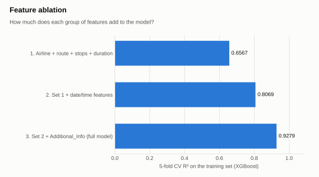
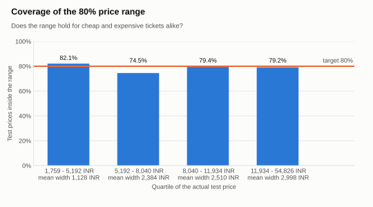
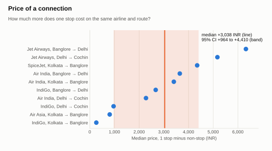

# Flight Price Prediction & Quote Assessment

Is the price quoted for this flight cheap, fair or expensive compared with similar flights?

**Live demo:** _coming soon_
<!-- DEMO_GIF: docs/images/demo.gif -->


Other tabs of the app: [Market insights](docs/images/insights.png) · [Business findings](docs/images/business.png) · [Model performance](docs/images/performance.png)

## Problem → Approach → Results

**Problem.** A travel-agency employee holds a quote for a domestic flight in India and needs to know whether the price is cheap, fair or expensive compared with similar flights, and which alternative would cost less.

**Approach.** A case study on 10,462 fares for March-June 2019 on five routes. One preprocessing function feeds an XGBoost price model and two quantile models that give a calibrated 80% price range; price comparisons hold airline, route and stops constant and report bootstrap confidence intervals.

**Results.** The price model reaches R² 0.872 and MAE 678 INR on a hold-out test set, and the 80% price range contains 78.8% of test prices. On the same airline and route a one-stop flight cost 3,038 INR more than a non-stop one (95% CI 964 to 4,410; 10 groups). The Jet Airways fare without a meal cost 3,436 INR less than its standard fare (95% CI 1,830 to 6,132; only 6 groups), while the uncontrolled comparison across airlines shows it as dearer: a reversal caused by airline mix (confounding).

> [!IMPORTANT]
> On the hold-out test set the price model reaches R² **0.872** with a mean absolute error of **678 INR**.
> The 80% price range contains **78.8%** of the test prices, against a target of 80%.

Every number about the data and the models in this README is printed by a script in this repo, named next to each table. The one outside fact, the date Jet Airways stopped flying, links to its source. More detail: [docs/analysis.md](docs/analysis.md) (findings, validation choices, error analysis), [docs/model_card.md](docs/model_card.md) (inputs, outputs, hyperparameters, price range), [docs/business_summary.md](docs/business_summary.md) (one page for non-technical readers).

## Results

**Data:** 10,683 raw rows → 10,462 after cleaning (220 exact duplicates and 1 row with missing values removed). 80/20 split: 8,296 training rows after removing 73 price outliers, 2,093 test rows with outliers kept.

**Model comparison - 5-fold cross-validation on the training set** (`python -m src.train`, [models/metrics.json](models/metrics.json))

| Model | CV R² | CV MAE (INR) |
| --- | --- | --- |
| Ridge (baseline) | 0.7042 ± 0.0073 | 1,639 ± 37 |
| RandomForest | 0.9136 ± 0.0049 | 656 ± 18 |
| **XGBoost** | **0.9281 ± 0.0033** | 609 ± 16 |
| XGBoost (log target) | 0.9267 ± 0.0033 | 605 ± 14 |

XGBoost has the highest CV R² and is refit on the full training set and saved. The log-target variant is within one standard deviation of it.

**Hold-out test set - XGBoost, evaluated once** (`python -m src.train`)

| Test subset | Rows | R² | MAE (INR) | RMSE (INR) |
| --- | --- | --- | --- | --- |
| All test rows (outliers included) | 2,093 | 0.8725 | 678 | 1,631 |
| Price ≤ 23,090 INR (training IQR fence) | 2,072 | 0.9301 | 586 | 1,072 |

The 21 test rows above the fence (16 of them Jet Airways) account for the gap between the two rows: the model was never trained on prices that high.

**What drives the score: feature ablation** (`python -m src.ablation`, [reports/ablation.json](reports/ablation.json))

<picture>
  <source media="(prefers-color-scheme: dark)" srcset="docs/images/fig_ablation_dark.svg">
  
</picture>

The date and time features lift CV R² from 0.6565 to 0.8073, and the fare remark in Additional_Info lifts it again to **0.9281** (`python -m src.make_figures`).

**80% price range** (`python -m src.train_intervals`, [models/interval_metrics.json](models/interval_metrics.json)). Two XGBoost quantile models (10% and 90%), calibrated with conformalized quantile regression; the full table and the choice of training set are in the [model card](docs/model_card.md#price-range).

<picture>
  <source media="(prefers-color-scheme: dark)" srcset="docs/images/fig_interval_coverage_dark.svg">
  
</picture>

Coverage stays between 74.5% and 82.1% in every price quartile, while the mean width of the range grows from 1,128 INR for the cheapest fares to **2,998 INR** for the dearest (`python -m src.make_figures`).

**Price of a connection** (`python -m src.business_analysis`, [reports/findings.json](reports/findings.json)). Same airline and route, at least 20 flights on each side; the 95% interval is a bootstrap over groups. The fare-class comparison and the cheapest option per route are in [docs/analysis.md](docs/analysis.md#results-in-inr).

<picture>
  <source media="(prefers-color-scheme: dark)" srcset="docs/images/fig_stops_premium_dark.svg">
  
</picture>

One stop was dearer than non-stop in all 10 airline and route groups, by 265 to 6,326 INR with a median of **3,038 INR** (`python -m src.make_figures`).

## How it works

```text
raw CSV → clean_raw + build_features → XGBoost price model + quantile models (CQR) → assess_quote → Streamlit app
```

The same `build_features` function computes the features for training and for a quote typed into the app.

| Tool | Used for |
| --- | --- |
| pandas | Cleaning and feature engineering |
| scikit-learn | Pipeline, one-hot encoding, cross-validation, Ridge and RandomForest for comparison |
| XGBoost | Price model and the two quantile models of the price range |
| Streamlit + Plotly | The app: predict, assess a quote, browse the findings |
| Matplotlib | README and analysis figures |
| pytest + GitHub Actions | Tests and a retraining run on every push |

## How to run

Python 3.12+ (tested on 3.13). Versions are pinned in `requirements.txt` because the committed `.joblib` models must be loaded with the library versions that wrote them. From the repo root, in a virtual environment:

```bash
pip install -r requirements-dev.txt
python -m pytest -q
python -m src.train          # compare models, save the model and models/metrics.json
streamlit run app.py
```

The trained models are committed, so the app works without retraining. The other reports are regenerated, in this order, by `python -m src.ablation`, `src.analysis`, `src.train_intervals`, `src.business_analysis`, `src.data_audit`, `src.model_card` and `src.make_figures`.

Running a script twice on the same machine gives identical output; on other hardware the metrics can differ slightly (about ±0.002 R²) because of floating-point summation order.

## Limitations

- **A 2019 market.** The data are fares offered in 2019, and the Indian airline market has changed a lot since: several of these airlines no longer fly or have merged (details and sources in [docs/analysis.md](docs/analysis.md#6-what-this-means-for-the-market-today)). The conclusions about prices do not apply today; the method does.
- **Narrow data.** An existing public Kaggle dataset, not collected by this project: journeys from March to June 2019, on five routes only (the app offers only these and warns about dates outside the window).
- **No booking date.** How far in advance a ticket is bought is a major price driver and is not in the data.
- **The date column may not be the actual flight date.** Jet Airways stopped all flights on 17 April 2019 ([Al Jazeera](https://www.aljazeera.com/economy/2019/4/17/indias-debt-ridden-jet-airways-suspends-all-operations)), yet 2,600 of its 3,706 rows carry a later journey date, and journeys fall on only 40 distinct dates (`python -m src.data_audit`, [reports/data_audit.json](reports/data_audit.json)). Day and month features should be read with caution.
- **Random split.** The headline scores describe interpolation within the same period. Trained on March-May and tested on June, MAE rises from 586 to 1,100 INR ([docs/analysis.md](docs/analysis.md#5-predicting-the-next-month-is-harder-than-the-headline-score-suggests)).
- **Rare categories.** No business-class row remains in the training set after the outlier filter, so the model cannot price business fares.

## Authors

Data Mining course project, team of three:

- Phan Thanh Tan (2213076)
- Tran Minh Tam (2212085)
- Vu Duc Lam (2211824)

The notebooks in `notebook/` are the original exploration for the course and are kept unchanged. Their numbers (for example XGBoost test R² 0.842) were computed before the evaluation was fixed (duplicates kept, outliers filtered before the split, a different feature set) and are superseded by the ones above.
