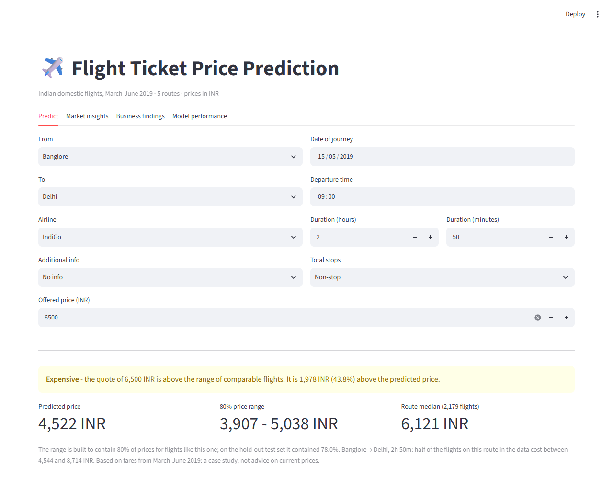
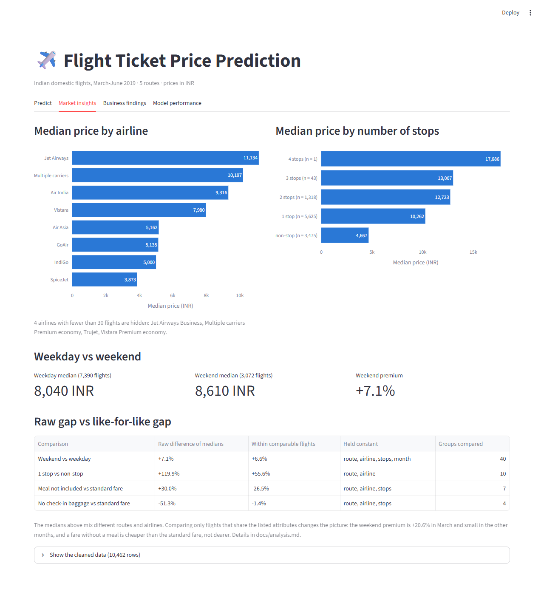
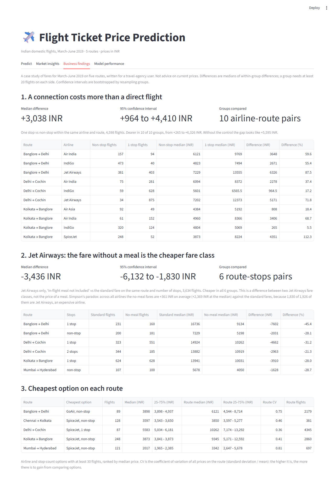
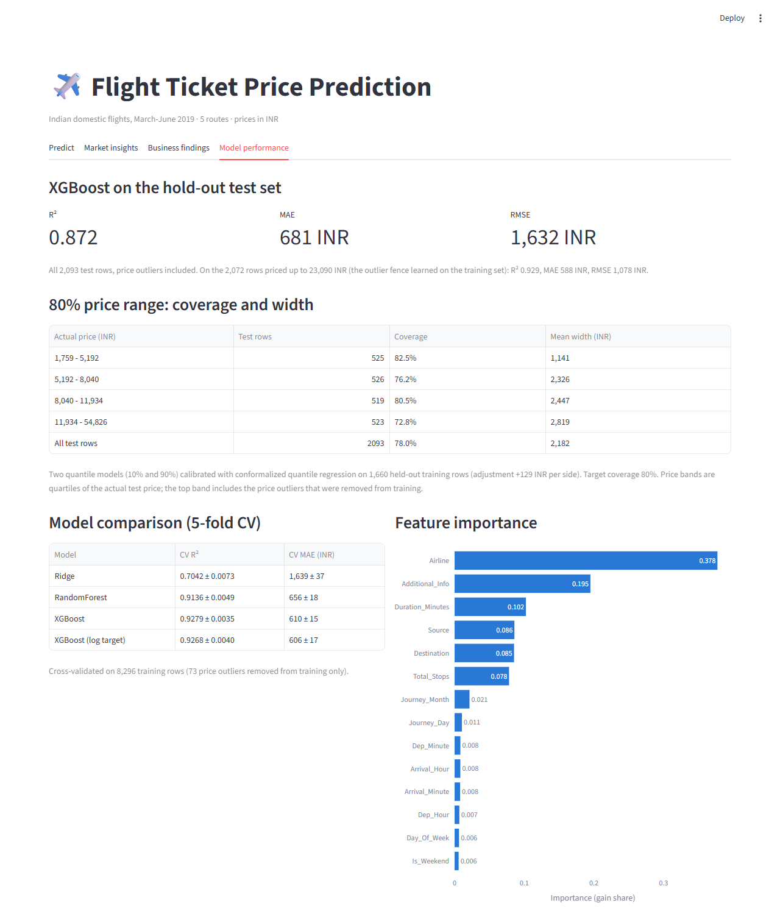

# Flight Ticket Price Prediction - Data Mining Assignment

**Problem.** A travel-agency employee holds a quote for a domestic flight in India and needs to know whether the price is cheap, fair or expensive compared with similar flights, and which alternative would cost less.

**Approach.** A case study on 10,462 fares for March-June 2019 on five routes. One preprocessing function feeds an XGBoost price model and two quantile models that give a calibrated 80% price range; price comparisons hold airline, route and stops constant and report bootstrap confidence intervals.

**Result.** The price model reaches R² 0.872 and MAE 681 INR on a hold-out test set, and the 80% price range contains 78.0% of test prices. On the same airline and route a one-stop flight cost 3,038 INR more than a non-stop one (95% CI 964 to 4,410; 10 groups). The Jet Airways fare without a meal cost 3,436 INR less than its standard fare (95% CI 1,830 to 6,132; 6 groups), although a naive comparison across airlines says it is dearer.

One-page summary for non-technical readers: [docs/business_summary.md](docs/business_summary.md). The data are from 2019, so this is not advice on current prices.

Live demo: <link>

Every number in this README is printed by a script in this repo and can be regenerated with the commands below.

| Predict | Market insights |
| --- | --- |
|  |  |
| **Business findings** | **Model performance** |
|  |  |

---

## Results

Produced by `python -m src.train` (also stored in [models/metrics.json](models/metrics.json)).

**Data:** 10,683 raw rows → 10,462 after cleaning (220 exact duplicates and 1 row with missing values removed). 80/20 split: 8,296 training rows after removing 73 price outliers, 2,093 test rows with outliers kept.

**Model comparison - 5-fold cross-validation on the training set**

| Model | CV R² | CV MAE (INR) |
| --- | --- | --- |
| Ridge (baseline) | 0.7042 ± 0.0073 | 1,639 ± 37 |
| RandomForest | 0.9136 ± 0.0049 | 656 ± 18 |
| **XGBoost** | **0.9279 ± 0.0035** | 610 ± 15 |
| XGBoost (log target) | 0.9268 ± 0.0040 | 606 ± 17 |

XGBoost has the highest CV R² and is the model that gets refit on the full training set and saved. The log-target variant is within one standard deviation of it.

**Hold-out test set - XGBoost, evaluated once**

| Test subset | Rows | R² | MAE (INR) | RMSE (INR) |
| --- | --- | --- | --- | --- |
| All test rows (outliers included) | 2,093 | 0.8722 | 681 | 1,632 |
| Price ≤ 23,090 INR (training IQR fence) | 2,072 | 0.9294 | 588 | 1,078 |

The 21 test rows above the fence (16 of them Jet Airways) account for the gap between the two rows: the model was never trained on prices that high.

**Feature ablation - XGBoost, 5-fold CV R² on the training set** (`python -m src.ablation`)

| Feature set | CV R² |
| --- | --- |
| 1. Airline + Source + Destination + Total_Stops + Duration_Minutes | 0.6567 ± 0.0297 |
| 2. Set 1 + all date/time features | 0.8069 ± 0.0090 |
| 3. Set 2 + Additional_Info (full model) | 0.9279 ± 0.0035 |

**80% price range** (`python -m src.train_intervals`, stored in [models/interval_metrics.json](models/interval_metrics.json)). Two XGBoost quantile models (10% and 90%), calibrated with conformalized quantile regression on 1,660 held-out training rows.

| Actual test price (INR) | Rows | Coverage | Mean width (INR) |
| --- | --- | --- | --- |
| 1,759 - 5,192 | 525 | 82.5% | 1,141 |
| 5,192 - 8,040 | 526 | 76.2% | 2,326 |
| 8,040 - 11,934 | 519 | 80.5% | 2,447 |
| 11,934 - 54,826 | 523 | 72.8% | 2,819 |
| All test rows | 2,093 | 78.0% | 2,182 |

Coverage is below the 80% target in the top quarter, which contains the price outliers removed from training. The point prediction comes from a separate model and lies inside the range for 93.0% of test rows.

---

## Key findings

Full write-up with tables and charts: [docs/analysis.md](docs/analysis.md). Produced by `python -m src.analysis`.

Raw gaps between medians mix different routes and airlines, so each attribute is also compared within groups of otherwise comparable flights.

| Comparison | Raw gap of medians | Like-for-like gap | Held constant |
| --- | --- | --- | --- |
| Weekend vs weekday | +7.1% | +6.6% | route, airline, stops, month |
| 1 stop vs non-stop | +119.9% | +55.6% | route, airline |
| "In-flight meal not included" vs standard fare | +30.0% | -26.5% | route, airline, stops |
| "No check-in baggage included" vs standard fare | -51.3% | -1.4% | route, airline, stops |

- **A fare without a meal looks 30% dearer and is in fact 26% cheaper.** The remark sits almost entirely on Jet Airways, the most expensive airline; within the same airline, route and stops it is cheaper in all 7 comparable groups.
- **One stop costs more than non-stop in every comparable group**, but about half of the raw gap comes from which routes have connecting flights.
- **The weekend premium is a March effect:** +20.6% in March, between +1.5% and +2.8% in the other months. It rests on only 2 to 3 weekend dates per month.
- **Model error is concentrated in a small tail.** The median absolute error is 294 INR against a mean of 681 INR; the worst 5% of test rows carry 38.7% of the total error, and fares above the outlier fence are underpredicted by 9,864 INR on average.
- **Forecasting a new month is harder than the headline score suggests.** Training on March-May and testing on June gives R² 0.846 and MAE 1,091 INR, against R² 0.929 and MAE 588 INR for comparable prices under the random split.

---

## What the numbers mean today

Short answer: they describe a 2019 market that no longer exists in this form, and they do not prove anything about Indian air fares or the airline economy in 2026. Details and sources are in [docs/analysis.md](docs/analysis.md#6-what-this-means-for-the-market-today).

- **The data are advertised fares collected in advance, not tickets flown.** Jet Airways stopped flying on 17 April 2019, yet 2,600 of its 3,706 rows have a later journey date. This is an inference from the dates; the dataset does not document how it was collected.
- **The period was a supply shock.** India grounded the Boeing 737 MAX on 13 March 2019 while Jet Airways was collapsing, and fares rose sharply at the time. In the data the median price falls from 18,472 INR on 1 March to 6,673 INR on 27 March.
- **Most of the airlines have changed or gone.** 37.3% of rows belong to airlines that have ceased operations (Jet Airways, GoAir, TruJet) and 7.6% to airlines since merged into the Air India group (Vistara, AirAsia India). Only 43.5% belong to names still operating. In August 2026 IndiGo carried about 65% of domestic passengers, and Akasa Air, third with 5.5%, did not exist in 2019.
- **The pricing environment is different.** Domestic fares were capped by the government from December 2025 to 23 March 2026, and fuel costs have risen since. The INR amounts here should not be compared with today's fares.

What does carry over is the method, not the conclusions:

| Claim | Supported? |
| --- | --- |
| The price levels or the model's predictions apply to tickets today | No. Error already rose 85% when predicting one month ahead inside 2019. |
| "Weekends cost more" or "connections cost 56% more" as rules for today | No. They rest on 2 to 3 weekend dates per month and on airlines that no longer fly. |
| In 2019, on these routes, the fare product explained more of the price than the calendar | Yes (ablation: R² 0.81 → 0.93). |
| Raw medians can point the wrong way when the airline mix is ignored | Yes, shown twice. This is a property of the method, not of the year. |
| A price model must be re-validated on a later period before being trusted | Yes. |

To say something about today's market, the same pipeline would have to be rerun on current fares, ideally with the booking date recorded.

---

## Validation choices

- **Duplicates are removed before the split.** The raw file has 220 fully duplicated rows. Splitting first would put copies of the same row in both train and test and inflate the test score.
- **Outlier fences are learned on the training set only.** The IQR bounds on price (upper fence 23,090 INR) are computed from training prices and applied to training rows only. The test set keeps its outliers, and results are reported both on the whole test set and on the in-range rows.
- **Model selection uses cross-validation, not the test set.** The four models are compared with 5-fold CV on the training set; the test set is used once, for the selected model.
- **One preprocessing function for training and prediction.** `src/preprocess.py::build_features` is the only place features are computed. Predictions build a row in the raw CSV layout (`make_raw_row`) and pass it through the same function. This fixes a bug in the previous CLI, which never filled the duration feature and therefore always predicted with a flight duration of 0. A test asserts that the serving path yields exactly the training features.
- **Label normalisation.** "New Delhi" and "Delhi" (Destination) are the same place, and "No Info" / "No info" (Additional_Info) are the same value; both are merged.
- **Fixed seeds.** All splits and models use `random_state=42`; running `src.train` twice yields an identical `metrics.json`.

### Is `Additional_Info` leakage?

No. `Additional_Info` describes the fare conditions of the ticket ("In-flight meal not included", "No check-in baggage included", "1 Long layover", ...). It is a property of the product that is shown to the buyer at booking time, not something derived from the price afterwards, so it is available when a prediction is needed. It is also the single most useful addition in the ablation (0.81 → 0.93), because it separates fare classes that share the same airline, route and schedule.

---

## Project structure

```plaintext
├── app.py                     # Streamlit app (4 tabs)
├── src/
│   ├── preprocess.py          # Cleaning + feature engineering shared by train and predict
│   ├── train.py               # Model comparison, test evaluation, saves model + metrics
│   ├── ablation.py            # Feature ablation
│   ├── analysis.py            # Like-for-like comparisons, error analysis, time-based validation
│   ├── train_intervals.py     # Quantile models + conformal calibration for the 80% price range
│   ├── business_analysis.py   # Findings in INR with bootstrap confidence intervals
│   ├── data_audit.py          # Jet Airways dates, fare remarks, route coverage
│   ├── predictor.py           # Loads the saved models, predicts and assesses a quote
│   ├── predict_cli.py         # Terminal interface
│   └── summary.py             # LaTeX tables generated from models/metrics.json
├── tests/                     # pytest: preprocessing and predictor
├── models/
│   ├── flight_price_pipeline.joblib   # Fitted sklearn Pipeline (one-hot + XGBoost)
│   ├── metrics.json                   # All metrics reported above
│   ├── flight_price_intervals.joblib  # Quantile models for the price range
│   ├── interval_metrics.json          # Coverage and width of the price range
│   └── analysis.json                  # All numbers in docs/analysis.md
├── data/
│   └── IndianFlightdata - Sheet1.csv  # Raw data used by the pipeline
├── notebook/                  # Original exploratory notebooks (see note below)
├── reports/                   # findings.json, data_audit.json and CSV tables
├── docs/
│   ├── business_summary.md    # One-page summary for non-technical readers
│   ├── analysis.md            # Key findings
│   └── images/                # App screenshots and analysis charts
└── .github/workflows/ci.yml   # Tests + training on every push
```

`data/` also contains `flight_cleaned.csv`, `airports.csv`, `flight_price.xlsx` and `archive.zip`. They are leftovers from the exploration phase and are not used by the pipeline.

---

## How to run

Requires Python 3.11+ (developed and tested on Python 3.13). The package versions in `requirements.txt` are pinned because the saved `.joblib` model must be loaded with the same library versions that wrote it; the pinned NumPy needs Python 3.12 or newer, so on Python 3.11 install a NumPy 2.4 release and retrain with `python -m src.train`.

All commands are run from the repo root.

```bash
python -m venv .venv
.venv\Scripts\activate            # Windows  (Linux/macOS: source .venv/bin/activate)
pip install -r requirements-dev.txt

python -m pytest -q               # tests
python -m src.train               # compare models, save model + metrics
python -m src.ablation            # feature ablation
python -m src.analysis            # numbers and charts for docs/analysis.md
python -m src.train_intervals     # 80% price range models + coverage metrics
python -m src.business_analysis   # findings -> reports/findings.json and CSV tables
python -m src.data_audit          # data audit -> reports/data_audit.json
python -m src.summary             # LaTeX tables from metrics.json
python -m src.predict_cli         # predict in the terminal
streamlit run app.py              # web app
```

The trained model is committed, so the app and the CLI work right after cloning without retraining.

### Deploy on Streamlit Community Cloud

1. Push the repo to GitHub (the app needs `app.py`, `requirements.txt`, `src/`, `models/`, `reports/` and `data/IndianFlightdata - Sheet1.csv`).
2. Go to [share.streamlit.io](https://share.streamlit.io), sign in with GitHub and click **Create app**.
3. Select this repository, the branch, and `app.py` as the main file.
4. Under **Advanced settings**, choose Python 3.13 so that the pinned versions match the saved model.
5. Click **Deploy**. Dependencies are installed from `requirements.txt`.

---

## Data and limitations

The data is an existing public Kaggle dataset of Indian domestic flight fares; this project did not collect it.

- **Four months of one year.** Journeys run from March to June 2019. The model knows nothing about other seasons or about price levels after 2019, and the app warns when a date outside this window is entered.
- **Five routes.** Banglore → Delhi, Delhi → Cochin, Kolkata → Banglore, Mumbai → Hyderabad and Chennai → Kolkata. The app only offers these.
- **No booking date.** How far in advance a ticket is bought is a major price driver and is not in the data.
- **The date column may not be the actual flight date.** Jet Airways stopped all flights on 17 April 2019, yet 2,600 of its 3,700 rows carry a later journey date, and its share of rows is higher in May (39.4%) than in March (32.8%). The rows are therefore either fares listed before the shutdown or dates that were not recorded as flown. Journeys also fall on only 40 distinct dates. The day and month features should be read with caution, and the data cannot be used to study what happened when Jet Airways left the market. Figures from `python -m src.data_audit` ([reports/data_audit.json](reports/data_audit.json)).
- **Random split.** The headline scores come from a random split over rows, so they describe interpolation within the same period. The time-based check in [docs/analysis.md](docs/analysis.md) shows the error on an unseen month is clearly higher.
- **Rare categories.** No business-class row remains in the training set after the outlier filter, so the model cannot price business fares.

## About the notebooks

The notebooks in `notebook/` are the original exploration for the course assignment and are kept unchanged. Their numbers differ from the ones above (for example XGBoost test R² 0.842) because they were computed before the evaluation was fixed: duplicates were kept, outliers were filtered before the train/test split, and the feature set was different. The numbers in this README supersede them.

---

## Authors
- [Phan Thanh Tan, 2213076
- Tran Minh Tam, 2212085
- Vu Duc Lam, 2211824]
- Course Project: Data Mining
