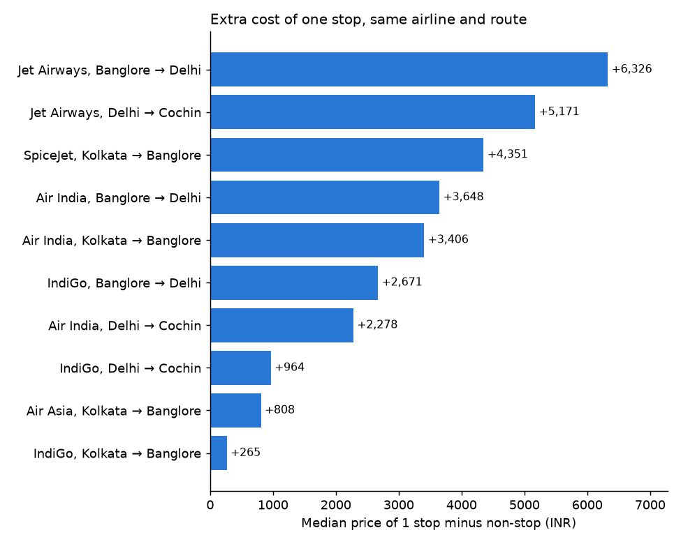
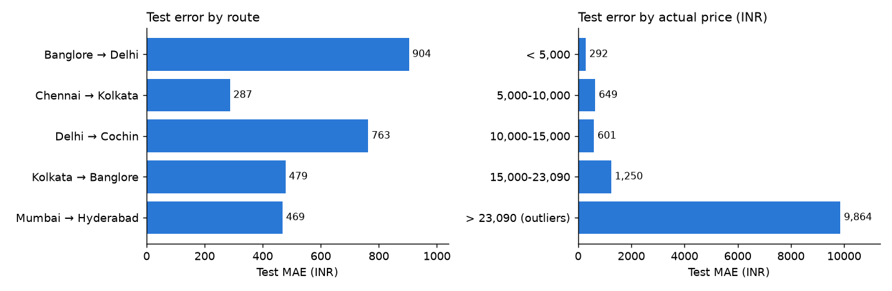
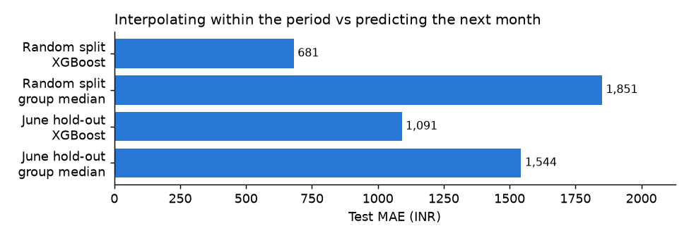

# Key findings

What the data says about Indian domestic flight prices (March-June 2019, 5 routes, 10,462 flights after cleaning), and where the price model can and cannot be trusted.

Every number below is printed by `python -m src.analysis` and stored in [models/analysis.json](../models/analysis.json).

**Method.** A raw gap between two medians mixes different routes and airlines. To separate the effect of one attribute, flights are grouped so that the other attributes are identical, the two sides are compared inside each group (only groups with at least 20 flights on each side), and the within-group differences are averaged, weighted by the number of flights. This is a descriptive like-for-like comparison, not a causal estimate.

| Comparison | Raw gap of medians | Like-for-like gap | Held constant | Groups |
| --- | --- | --- | --- | --- |
| 1 stop vs non-stop | +119.9% | +55.6% | route, airline | 10 |
| "In-flight meal not included" vs standard fare | +30.0% | -26.5% | route, airline, stops | 7 |
| "No check-in baggage included" vs standard fare | -51.3% | -1.4% | route, airline, stops | 4 |
| Weekend vs weekday | +7.1% | +6.6% | route, airline, stops, month | 40 |

The README and [business_summary.md](business_summary.md) report the stops and fare-class comparisons in INR from `python -m src.business_analysis` ([reports/findings.json](../reports/findings.json)): +3,038 INR and -3,436 INR. Those figures are the median of the within-group differences with a bootstrap confidence interval, and the fare-class one is restricted to Jet Airways (6 groups). The figures on this page are flight-weighted means, and the fare-class comparison here also includes one "Multiple carriers" group (7 groups). Both describe the same pattern; the numbers differ because the summary statistic and the groups differ.

---

## 1. One stop costs more than non-stop, but half of the raw gap is the route mix

The raw gap between 1-stop and non-stop flights is +5,595 INR (+119.9%). Much of it comes from where each kind of flight operates: Chennai → Kolkata has only non-stop flights, while Delhi → Cochin has 3,185 one-stop flights and 213 non-stop.

Within the same route and airline the gap is +3,411 INR (+55.6%). It is positive in all 10 comparable groups, from +265 INR (IndiGo, Kolkata → Banglore) to +6,326 INR (Jet Airways, Banglore → Delhi).

**So what.** In this market a connecting flight is a dearer product than a direct one, not a discount option, and the size of the premium depends heavily on the airline. The comparison covers 4,598 of the 9,100 one-stop and non-stop flights, in 10 groups; the rest sit in groups too small to compare.

## 2. A fare without a meal looks 30% dearer, and is in fact 26% cheaper

Across the whole dataset, tickets marked "In-flight meal not included" have a median price 2,369 INR (+30.0%) above tickets with no remark. Comparing the same airline, route and number of stops reverses the sign: the no-meal fare is cheaper by 3,453 INR (-26.5%) on average, ranging from -16.1% (Multiple carriers, Delhi → Cochin, 1 stop) to -45.4% (Jet Airways, Banglore → Delhi, 1 stop).

This is a reversal caused by airline mix (confounding): 1,830 of the 1,926 tickets with this remark are Jet Airways, the airline with the highest median price in the data. Simpson's paradox is the textbook example of such a reversal.

The result rests on few groups. Only 7 groups have at least 20 flights on each side, 6 of them Jet Airways and 1 "Multiple carriers"; the no-meal fare is cheaper in all 7. It describes the gap between fare classes, mostly of one airline, not the price of a meal.

The same kind of mix effect, in the other direction, appears with "No check-in baggage included". The raw gap is -51.3%, but all 318 tickets with this remark are SpiceJet, the airline with the lowest median price. Like for like, the fare without baggage is only 45 INR (-1.4%) cheaper, in all 4 comparable groups (all SpiceJet non-stop).

**So what.** `Additional_Info` identifies the fare product, and its effect can only be read within an airline. This is why adding it lifts the model's cross-validated R² from 0.81 to 0.93 (see the ablation in the README): it separates fares that share the same airline, route and schedule.

## 3. The "weekend premium" is a March effect

The app's headline number, weekend flights +7.1% dearer, barely changes when route, airline, stops and month are held constant (+6.6%). But the average hides the pattern: the weekend is dearer in only 19 of 40 groups.

| Month | Like-for-like weekend gap | Groups | Groups where the weekend is dearer |
| --- | --- | --- | --- |
| March | +20.6% | 11 | 8 |
| April | +2.8% | 5 | 2 |
| May | +1.5% | 10 | 4 |
| June | +2.6% | 14 | 5 |

**So what.** Outside March there is no reliable weekend premium in this data, so "weekends cost 7% more" should not be presented as a general rule. The comparison is also thinner than the row counts suggest: journeys fall on only 40 distinct dates, with 2 or 3 weekend dates per month, and March prices fall steeply through the month (see section 6), so the March figure compares a handful of specific dates.

## 4. The model is accurate on typical fares; a small tail carries the error

On the hold-out test set (2,093 flights) the mean absolute error is 681 INR, but the median absolute error is 294 INR (3.9% of the price). 65.5% of predictions are within 500 INR. The worst 5% of rows account for 38.7% of the total error.

| Actual price (INR) | Test rows | MAE (INR) | Mean error (INR) |
| --- | --- | --- | --- |
| < 5,000 | 491 | 293 | +153 |
| 5,000-10,000 | 783 | 649 | +264 |
| 10,000-15,000 | 663 | 601 | -163 |
| 15,000-23,090 | 135 | 1,250 | -898 |
| > 23,090 (outliers) | 21 | 9,864 | -9,864 |

- **Expensive tickets are underpredicted.** Fares above the training outlier fence are missed by 9,864 INR on average, always on the low side: the model never saw prices that high. The 15,000-23,090 band is also underpredicted, by 898 INR on average. Part of this is expected when error is grouped by the actual price, since any model pulls extreme values toward the average.
- **By route**, Banglore → Delhi is the weakest (MAE 904 INR, underpredicted by 313 INR on average); Chennai → Kolkata, which has only non-stop flights, is the easiest (MAE 287 INR).
- **By airline**, "Multiple carriers" is the hardest (MAE 1,344 INR over 259 test rows) and SpiceJet the easiest (MAE 209 INR over 164 rows). "Multiple carriers" is a label for itineraries that combine airlines, so it hides the information that drives the price.
- **Some error cannot be removed with these features.** 450 flights share every model feature with another flight and still have a different price. On those rows, even predicting the group's own median misses by 1,100 INR on average. The missing driver is most likely the booking date.

**So what.** The app's "± 681 INR" understates the accuracy for a typical ticket and badly overstates it for expensive ones. A price-dependent range would be more honest than a single number.

## 5. Predicting the next month is harder than the headline score suggests

The headline evaluation splits rows at random, so the test flights come from the same weeks as the training flights. Training on March-May (7,058 flights) and testing on June (3,311 flights) asks the harder question.

| Evaluation | XGBoost R² | XGBoost MAE (INR) | Baseline R² | Baseline MAE (INR) |
| --- | --- | --- | --- | --- |
| Random 80/20 split, all test rows | 0.8722 | 681 | 0.5468 | 1,851 |
| Random 80/20 split, prices up to 23,090 INR | 0.9294 | 588 | - | - |
| Train March-May, test June | 0.8457 | 1,091 | 0.6954 | 1,544 |

The baseline predicts the training-set median price of the same airline, route and number of stops.

June contains no price above the outlier fence, so the fair comparison for the June result is the in-range row: MAE rises from 588 to 1,091 INR (+85%) and R² falls from 0.929 to 0.846. The model still beats the baseline in June (1,091 vs 1,544 INR), but its advantage shrinks from 1,170 INR to 453 INR.

**So what.** The model is good at filling in prices inside a period it has seen and noticeably weaker at forecasting a new month. Monthly price levels move a lot (median 9,769 INR in March, 5,073 in April, 8,662 in May, 8,510 in June), and four months of one year are not enough to learn a seasonal pattern.

## 6. What this means for the market today

Short answer: the numbers describe a 2019 market that no longer exists in this form. They do not prove anything about Indian air fares or the airline economy in 2026. What they support is narrower, and listed at the end of this section.

**The data are advertised fares collected in advance, during a supply shock.**

- Jet Airways stopped flying on 17 April 2019. Yet 2,600 of its 3,706 rows in the data have a later journey date. Those flights never operated, so the rows must be fares listed for sale before the collapse, not tickets that were flown. This is an inference from the dates; the dataset does not document how it was collected.
- India grounded the Boeing 737 MAX on 13 March 2019, and reports at the time describe sharp fare increases as capacity fell. Jet Airways was shrinking through the same weeks. The data cover exactly this period.
- Journeys fall on only 40 distinct dates, 10 per month. In March the median price falls from 18,472 INR on 1 March and 15,077 INR on 6 March to 6,673 INR on 27 March. A fare for a flight a few days away is normally dearer than one for a flight weeks away, so this pattern is what a single collection date in late February or early March would produce. The data cannot separate that from the capacity shock.

**Most of the airlines in the data have changed or gone.**

| What happened to the airline since 2019 | Rows | Share |
| --- | --- | --- |
| Still operating under the same name (IndiGo, Air India, SpiceJet) | 4,552 | 43.5% |
| Ceased operations (Jet Airways, GoAir / Go First, TruJet) | 3,901 | 37.3% |
| Unidentified ("Multiple carriers") | 1,209 | 11.6% |
| Merged into the Air India group (Vistara, AirAsia India) | 800 | 7.6% |

In August 2026 IndiGo carried about 65% of domestic passengers, the Air India group 26.7% and Akasa Air, which did not exist in 2019, 5.5%. In this data the largest single source of rows, and the main full-service carrier, is Jet Airways (35.4% of rows). The two findings with the largest effects, the largest connecting-flight premiums (finding 1) and the fare-condition discount (finding 2), are mostly Jet Airways pricing.

**The pricing environment has changed too.** Between December 2025 and 23 March 2026 the government capped domestic economy fares by distance (7,500 INR up to 500 km, rising to 18,000 INR beyond 1,500 km), and airlines have since faced higher fuel costs. Neither regulation nor seven years of cost changes are in the data, so the INR amounts here should not be compared with today's fares.

**What the analysis does and does not support.**

| Claim | Supported? |
| --- | --- |
| The price levels or the model's predictions apply to tickets today | No. The error already rose 85% when predicting one month ahead inside 2019 (finding 5). |
| "Weekends cost more" or "connections cost 56% more" as rules for today | No. The weekend comparison rests on 2 to 3 weekend dates per month, and the premiums are tied to airlines that no longer fly. |
| In 2019, on these five routes, the fare product explained more of the price than the calendar did | Yes (ablation: R² 0.81 → 0.93 when `Additional_Info` is added). |
| Raw comparisons of medians can point the wrong way once the airline mix is ignored (confounding) | Yes, shown twice (meal and baggage remarks). This is a property of the method, not of the year. |
| A price model must be re-validated on a later period before being trusted | Yes (finding 5). |

To say something about today's market, the same pipeline would have to be rerun on current fares, ideally with the booking date recorded. The like-for-like method and the time-based validation carry over unchanged; the conclusions have to be re-earned.

### Sources

- Boeing 737 MAX grounding in India on 13 March 2019 and the fare spike that followed: [Business Standard / Fitch](https://www.business-standard.com/article/companies/boeing-737-max-grounding-led-to-steep-rise-in-airfares-in-india-fitch-119040500189_1.html), [Business Today](https://www.businesstoday.in/industry/aviation/story/air-fares-rise-spicejet-jet-airways-indigo-flight-operations-178335-2019-03-14)
- Jet Airways: last flight 17 April 2019, liquidation ordered 7 November 2024: [Business Standard](https://www.business-standard.com/companies/news/fate-of-jet-airways-sealed-as-sc-orders-liquidation-route-says-jkc-failed-124110700691_1.html)
- Go First (formerly GoAir): operations stopped May 2023, liquidation approved January 2025: [ch-aviation](https://www.ch-aviation.com/news/149462-tribunal-orders-liquidation-of-indias-go-first)
- TruJet: operations stopped 15 February 2022: [Wikipedia](https://en.wikipedia.org/wiki/TruJet)
- Vistara merged into Air India on 12 November 2024; AirAsia India (AIX Connect) merged into Air India Express on 1 October 2024: [Air India press release](https://www.airindia.com/in/en/newsroom/press-release/vistara-merger-completed-second-airline.html)
- Domestic market shares, August 2026 (IndiGo 65%, Air India Group 26.7%, Akasa Air 5.5%): [RetailIntel summary of DGCA data](https://retailintel.in/signal/india-domestic-air-traffic-falls-6-34-yoy-in-august-indigo-s-b1dbd53b)
- Domestic fare caps introduced December 2025 and lifted 23 March 2026: [Business Today](https://www.businesstoday.in/india/story/centre-lifts-domestic-airfare-caps-from-march-23-after-indigo-crisis-cautions-airlines-against-price-surge-521729-2026-03-22)

---

## Data quality notes

- 221 of 10,683 raw rows are removed by cleaning: 220 exact duplicates and 1 row with missing values.
- Two pairs of labels mean the same thing and are merged: "New Delhi" / "Delhi" and "No Info" / "No info".
- In 3 rows the arrival time does not equal departure time plus duration, and 1 row has a duration under 30 minutes. They are kept: the rows are too few to matter and there is no way to tell which field is wrong.
- 4 airlines and 6 `Additional_Info` values have fewer than 30 flights each, so nothing can be concluded about them.
- April has only 1,078 flights, against 2,678 to 3,395 in the other months.

## Limits of this analysis

- The comparisons are like-for-like on the listed attributes only. Departure time, duration and booking date are not held constant.
- Groups with fewer than 20 flights on either side are left out, so each comparison covers only part of the data (the counts are in `models/analysis.json`).
- One year, four months, five routes: none of these findings should be assumed to hold for other periods or routes.
