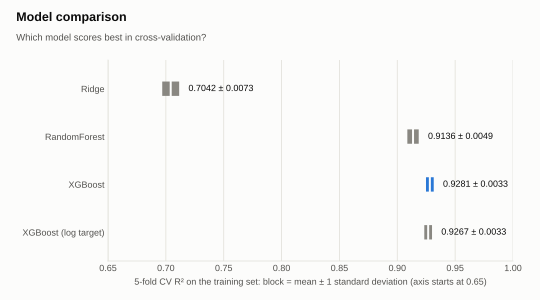
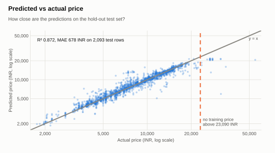
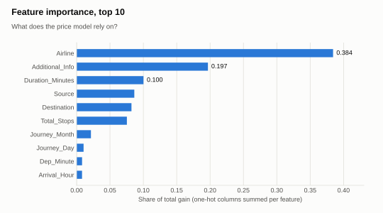

# Model card

Generated by `python -m src.model_card` from the saved model files and stored in [reports/model_card.json](../reports/model_card.json). The script prints the two tables below. The figures are drawn by `python -m src.make_figures`.

## Inputs

The pipeline takes the 14 columns below, which `src/preprocess.py::build_features` derives from a fare in the raw CSV layout. Valid values of the text columns are the categories of the fitted one-hot encoder; the ranges of the numeric columns are those seen in the training set. Valid routes: Banglore → Delhi, Chennai → Kolkata, Delhi → Cochin, Kolkata → Banglore and Mumbai → Hyderabad.

| Column | Type | Valid values |
| --- | --- | --- |
| `Airline` | str | Air Asia, Air India, GoAir, IndiGo, Jet Airways, Multiple carriers, Multiple carriers Premium economy, SpiceJet, Trujet, Vistara, Vistara Premium economy |
| `Source` | str | Banglore, Chennai, Delhi, Kolkata, Mumbai |
| `Destination` | str | Banglore, Cochin, Delhi, Hyderabad, Kolkata |
| `Additional_Info` | str | 1 Long layover, Change airports, In-flight meal not included, No check-in baggage included, No info, Red-eye flight |
| `Total_Stops` | int64 | 0 to 3 |
| `Journey_Day` | int32 | 1 to 27 |
| `Journey_Month` | int32 | 3 to 6 |
| `Day_Of_Week` | int32 | 0 to 6 |
| `Is_Weekend` | int64 | 0 to 1 |
| `Dep_Hour` | int64 | 0 to 23 |
| `Dep_Minute` | int64 | 0 to 55 |
| `Arrival_Hour` | int64 | 0 to 23 |
| `Arrival_Minute` | int64 | 0 to 55 |
| `Duration_Minutes` | int64 | 5 to 2860 |

## Outputs

A predicted price in INR; an 80% price range built from the 10% and 90% quantile predictions, widened by 118 INR on each side by the calibration; and, when a quote is given, a label: Cheap below the range, Fair inside it (ends included), Expensive above it.

## Hyperparameters

Only the values that differ from the XGBoost defaults, read with `get_params()` from the saved models.

| Hyperparameter | Point model | 10% quantile model | 90% quantile model |
| --- | --- | --- | --- |
| `colsample_bytree` | 0.8 | 0.8 | 0.8 |
| `learning_rate` | 0.05 | 0.05 | 0.05 |
| `max_depth` | 8 | 8 | 8 |
| `n_estimators` | 600 | 600 | 600 |
| `n_jobs` | 4 | 4 | 4 |
| `objective` | default | reg:quantileerror | reg:quantileerror |
| `quantile_alpha` | default | 0.1 | 0.9 |
| `random_state` | 42 | 42 | 42 |
| `subsample` | 0.8 | 0.8 | 0.8 |

## Training data

The point model is trained on **8,296 rows** with journey dates from 2019-03-01 to 2019-06-27, after removing the 73 training prices above the outlier fence of 23,090.5 INR. Library versions: scikit-learn 1.9.1 and xgboost 3.4.1; the point model and the quantile models were last changed in commit `3d90965`.

## Performance

The headline scores are in the [README](../README.md#results). Two more views of the point model:

<picture>
  <source media="(prefers-color-scheme: dark)" srcset="images/fig_models_dark.svg">
  
</picture>

XGBoost leads at **0.9281** with the log-target variant (0.9267) inside its one-standard-deviation block, while the Ridge baseline stays at 0.7042 (`python -m src.make_figures`).

<picture>
  <source media="(prefers-color-scheme: dark)" srcset="images/fig_pred_vs_actual_dark.svg">
  
</picture>

Predictions follow the diagonal up to the outlier fence of **23,090 INR** and fall well below it for the dearer test fares (`python -m src.make_figures`).

<picture>
  <source media="(prefers-color-scheme: dark)" srcset="images/fig_importance_dark.svg">
  
</picture>

Airline (0.384) and Additional_Info (0.197) carry more than half of the total gain, while the largest date or time feature, Journey_Month, has 0.021 (`python -m src.make_figures`).

## Price range

Produced by `python -m src.train_intervals` and stored in [models/interval_metrics.json](../models/interval_metrics.json). Two XGBoost quantile models (10% and 90%) are fitted on 6,695 training rows and calibrated with conformalized quantile regression on the other 1,674, for a target coverage of 80%. Two training sets were compared: with the price outliers removed (the rule of the point model) and with them kept.

| Actual test price (INR) | Rows | Coverage, outliers removed | Mean width (INR) | Coverage, outliers kept | Mean width (INR) |
| --- | --- | --- | --- | --- | --- |
| 1,759 - 5,192 | 525 | 82.5% | 1,120 | 82.1% | 1,128 |
| 5,192 - 8,040 | 526 | 76.4% | 2,351 | 74.5% | 2,384 |
| 8,040 - 11,934 | 519 | 79.8% | 2,464 | 79.4% | 2,510 |
| 11,934 - 54,826 | 523 | 72.8% | 2,805 | 79.2% | 2,998 |
| All test rows | 2,093 | 77.9% | 2,183 | **78.8%** | **2,254** |

The quantile models trained with the outliers kept are the ones saved and used by the app. The rule, fixed before looking at the result, was to keep them only if overall coverage stayed within 75-85% and coverage of the top price quartile increased; it rose from 72.8% to 79.2%, for a range 70 INR wider on average. The point model is unchanged and still trains without outliers. Its prediction lies inside the range for 92.4% of test rows. For the remaining rows the app and `assess_quote` show the point prediction clamped to the nearest end of the range, so the displayed price is always inside it; the Cheap / Fair / Expensive label depends only on the range. The metrics in [models/metrics.json](../models/metrics.json) are those of the unclamped point model.

## Load the model and predict one flight

```python
import joblib
from src.preprocess import build_features, make_raw_row

pipeline = joblib.load("models/flight_price_pipeline.joblib")
row = make_raw_row("IndiGo", "Banglore", "Delhi", "24/03/2019", "22:20", 170, 0)
print(pipeline.predict(build_features(row))[0])  # predicted price in INR
```

`src.predictor.assess_quote` returns the price range and the label as well.
